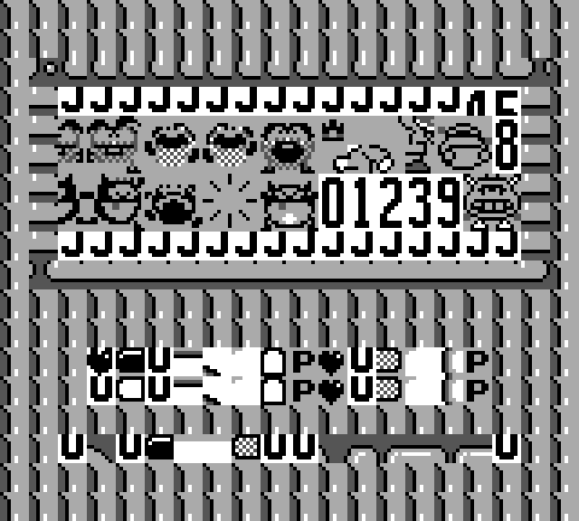
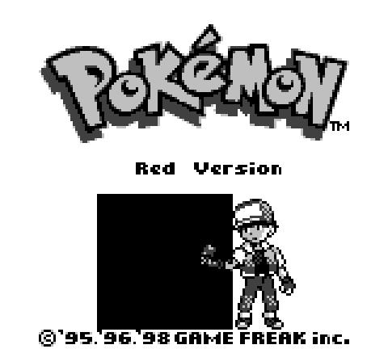
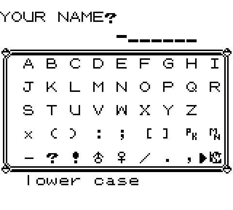
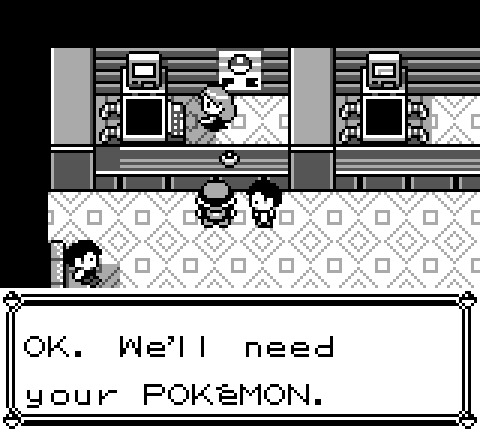
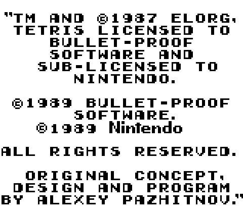
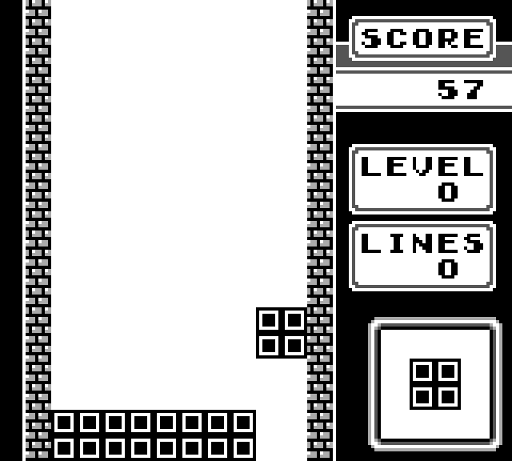
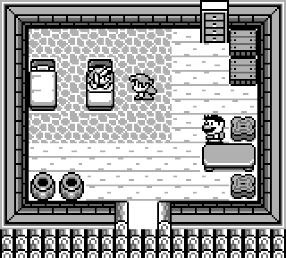
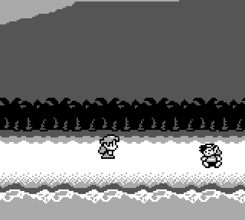
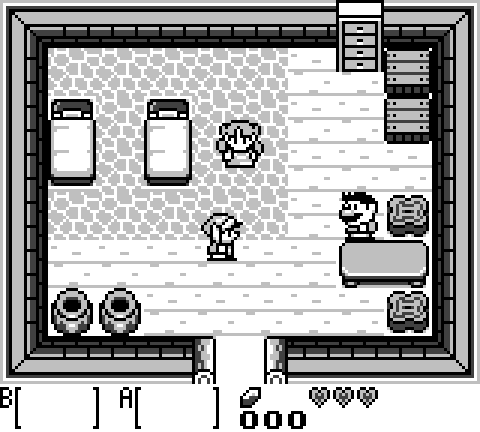

[<< Back to Last Page](../)

# Common Bugs & Issues

The following is a list of common bugs that occur when starting up games on in-development emulators and potential sources these issues could be caused by. If you encounter any bugs while developing your own emulator that have not been listed on this page, feel free to contact me on Discord (Optix™#3264) and I'll add it.

## Jump to a Specific Game

  * [Bomberman GB](#bomberman-gb)
  * [Bubble Bobble](#bubble-bobble)
  * [Dr. Mario](#dr-mario)
  * [Pokémon Red/Blue Version](#pokémon-redblue-version)
  * [Tetris](#tetris)
  * [The Legend of Zelda: Link's Awakening](#the-legend-of-zelda-links-awakening)

## Bomberman GB

### Unable to move left/right

In the Bomberman GB Games (both the Japanese and the US/Europe Versions), you may not be able to move left or right, while vertical movement works just as intended. This is most likely caused by incorrectly handling the case where both the Joypad as well as the Action Buttons are selected in the Joypad register. In this case, both the joypad buttons as well as the action buttons are mapped to their respective bits, and the bit is set to 0 if at least one of the two corresponding buttons is pressed.

## Bubble Bobble

### Blank Screen / Bootloop after Intro Sequence

When starting up Bubble Bobble an Intro Sequence plays, which places the player character in the first stage. However, as soon as the player is placed and gameplay should begin, the game may lock up on a blank screen or simply restart entirely. This is most likely due to a missing delay on the EI instruction, as interrupts are only enabled once the instruction *after* EI has finished execution.

**In-depth Explanation:** On hardware, the execution of the EI instruction overlaps with the fetch of the next instruction, and since instructions cannot be interrupted mid-execution, the next instruction after EI is still executed before interrupts can occur. DI takes effect immediately, as it disables the interrupt check while it is being executed. (Thanks to gekkio for this explanation)

## Dr. Mario

### Messed up Title Screen

Dr. Mario is, right after Tetris, one of the most common games to attempt to boot up early on in emulator development. However, while Tetris may look and function perfectly fine, Dr. Mario (as well as a few other games) may look like this:

Seeing this exact image as the title screen of Dr. Mario is a common misunderstanding of the "8800 Addressing Mode" of the PPU, using the address `$8800` as the base address for tile data rather than the correct `$9000` address.

### Blank Screen when Starting Game

When attempting to start a game of Dr. Mario, the title and mode selection screens may work as intended, however, as soon as the game is supposed to actually start up, it may freeze on a blank white screen. This is most likely an issue with the PPU STAT register (`$FF41`), specifically with the PPU mode bits. Dr. Mario turns off the LCD and runs an infinite loop until the mode bits read zero, which should be the case immediately after turning off the LCD, as this resets the PPU mode to zero.

## Pokémon Red/Blue Version

### Black Box on Title Screen

Instead of a proper Pokémon, the following black box may appear on the title screen of both the Red and Blue Version of the Pokémon Games:

This is most likely an issue with a faulty MBC implementation. Specifically, this bug occurs when SRAM is unimplemented, as the game uses SRAM as a decompression buffer for sprite data. 
(SRAM being used as a decompression buffer is precisely why encountering MISSINGNO. or other glitch Pokémon destroys Hall of Fame data, as sprites of glitch Pokémon are usually very large and overflow the sprite decompression buffer located right before Hall of Fame data in SRAM. )

### Corrupted ED-Tile on Name Input Screen

When entering the Name Input Screen in the beginning of Pokémon Red/Blue, the following corrupted tile may be seen:

This is related to a faulty MBC3 implementation. The game attempts to set the ROM bank number to zero by writing to memory range $4000-$7FFF, however, the MBC should map ROM bank 1 instead of 0.

### Freeze in Pokémon Center

When trying to heal your Pokémon in a Pokémon Center, the game may freeze on the following frame:

This is usually an issue with the NR50 register (`$FF24`). Making the register read- and write-able rather than returning a fixed value should fix the issue. Alternatively, a constant return value of 0 should also function as a workaround, but is not necessarily recommended.

## Tetris

### Flickering Copyright Notice

A very common issue for newly developed emulators is flickering on the following copyright notice screen:

This is most likely caused by the I/O register at memory address `$FF00` (which is the Joypad Register) returning zero when read from. This is due to the fact that the bit values of the Joypad registers are inverted - 0 means "pressed" while 1 means "not pressed". Tetris has a "reset" button combo which resets the game fully to the copyright notice screen if A+B+START+SELECT are all pressed. If reading from memory address `$FF00` returns zero, the game assumes all these buttons are pressed and resets, causing the flickering.

### Non-random Blocks

Another fairly common beginner issue with Tetris is a lack of randomization for the block shapes that drop down ingame, such as the following:

This is most likely due to an issue with the DIV register ($FF04), as it's used to "randomize" the shapes. In-development emulators may simply map this address to the value zero, resulting in the game always dropping 2x2 blocks. Other values may lead to other shapes being dropped.

### Crash when Starting Game or Demo

Tetris may crash in some way when attempting to start the game or waiting in the main menu for the demo to play. These crashes may look different depending on a few factors, ranging from a visually glitched main menu to a completely blank screen. However, this is most likely due to the emulator letting the game change values in ROM by writing to them. Specifically, Tetris writes a value to the memory address `$2000`, which should simply be ignored.

## The Legend of Zelda: Link's Awakening

### Broken Item Bar

When starting The Legend of Zelda: Link's Awakening, the bar at the bottom of the screen, in which the selected items should be displayed, may not be visible. Instead, something like this can be seen:

This is most likely a problem with handling values of the WX register (`$FF4B`) that are below 7. The value of the WX register is often defined as "Window X Position plus 7", however, Link's Awakening sets the value of WX to 6, which new emulators may incorrectly evaluate to 255 by subtracting 7 while handling the value as an unsigned 8 bit integer. Instead, signed values should be used, as WX values below 7 should shift the window off the screen to the left.

### Flickering Line in Intro Sequence

In the opening sequence of The Legend of Zelda: Link's Awakening, specifically the segment where the beach is shown, with the mountain in the background, the first line of pixels may flicker and look a bit off, such as in the following image:

This is most likely related to a missing implementation of the "scanline 153 quirk". 4 T-cycles after LY is incremented to 153 it is reset to 0, which also affects LY=LYC STAT interrupts. Note that only the LY register is affected by this quirk, all other functions behave the same way as during any other VBlank-scanline.

### Walking Animation without Movement

While technically not a major issue, many emulators don't filter out "impossible" inputs, such as pressing left and right at the same time on the Joypad. This can cause the following issue in The Legend of Zelda: Link's Awakening:

This doesn't break the game itself, but could be a bit uncomfortable for players to deal with when accidentally pressing two opposing D-Pad buttons at the same time. Simply filtering out button presses of Left-Right and Up-Down at the same time is enough to fix this issue.
