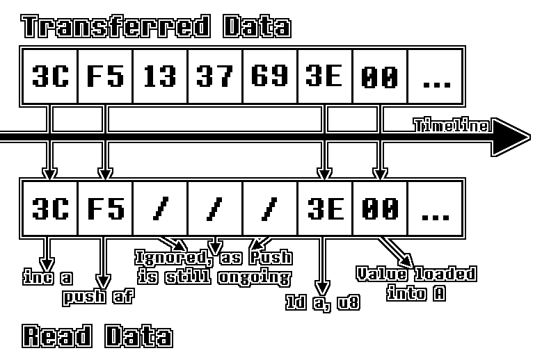

[<< Back to Last Page](../)

# Direct Memory Access (DMA)

- [An Introduction](#an-introduction)
- [OAM DMA](#oam-dma)
  * [DMA Control Register (DMA : $FF46)](#dma-control-register--dma----ff46-)
  * [DMA Bus Conflicts](#dma-bus-conflicts)

# An Introduction

Direct Memory Access (abbreviated to DMA) is a process where, instead of copying bytes using program code, the hardware takes care of the memory transfer. This is done simply because it's much, much faster than manually copying data. However, at the same time, it's (to some extent) limiting to the hardware for the duration of the transfer.

# OAM DMA

The original DMG Gameboy only features one type of DMA Transfer - the OAM DMA. This is used to copy a section of data to OAM memory. Many games have a separate "Shadow OAM" in RAM, which can be modified while the PPU is pushing pixels to the LCD, unlike "real" OAM memory. Then, once VBlank occurs, OAM DMA is executed, transferring the Shadow OAM data to real OAM in a time-efficient manner.

## DMA Control Register (DMA : $FF46)

Writing to this register initializes an OAM DMA transfer. The value written to it determines the source address which data should be read from, which is calculated as follows:

```
Source:      $XX00 - $XX9F
Destination: $FE00 - $FE9F
```

Where `XX` is replaced by the value written to the register.

After writing to the register a delay of 4 T-cycles occurs before the DMA transfer actually begins. Once started, the transfer copies one byte every 4 T-cycles, adding up to a total duration of 644 T-cycles (including the initialization delay). During this period (except for the initialization delay), reading from ROM and RAM is affected by DMA Bus Conflicts, which will be explained in the following paragraphs.

The HRAM section of memory is unaffected by DMA Transfers, and is therefore often used for OAM DMA procedures.

## DMA Bus Conflicts

During DMA transfers, the data buses used for reading/writing to ROM and RAM are occupied by the DMA transfer itself. This causes write-operations to be ignored completely and read-operations to return incorrect values.

**Note:** This behaviour is different on CGB. Reading/writing to and from ROM/RAM may be possible under certain circumstances. (TODO: Actually test this thoroughly)

When the CPU attempts to read a byte from ROM/RAM during a DMA transfer, instead of the actual value at the given memory address, the byte that is currently being transferred by the DMA transfer is returned. This also affects the CPU when fetching opcodes, allowing for code execution through DMA transfers.

The following is a more visual demonstration of code execution using DMA transfers:

