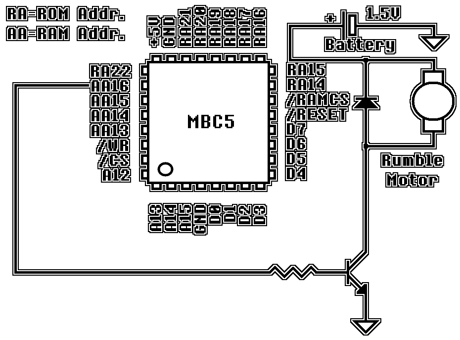
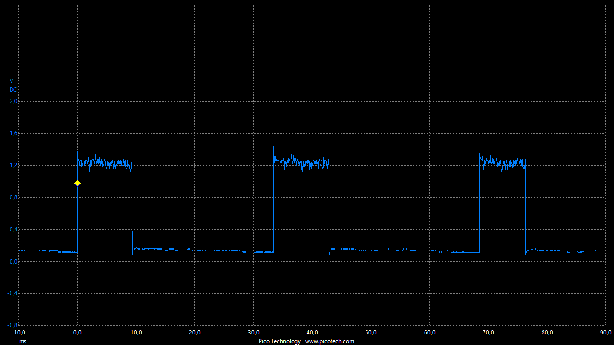
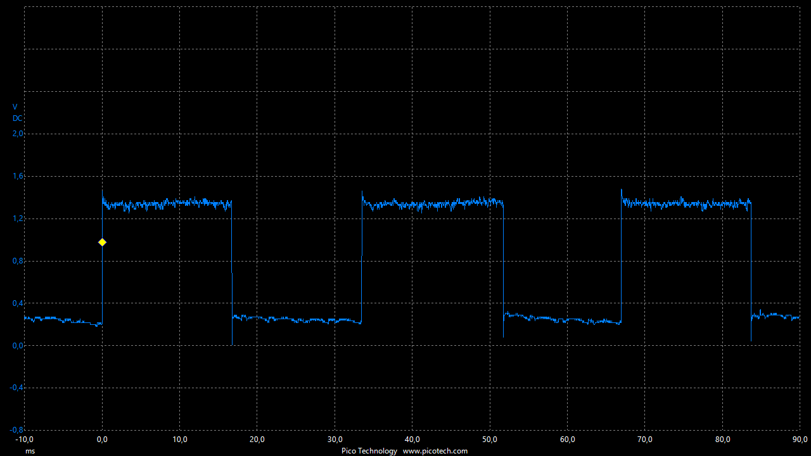

[<< Back to Last Page](../)

# MBC5

The MBC5 is a relatively common MBC with high storage capabilities, supporting up to 512 ROM banks (8MB) as well as up to 16 RAM banks (128kB) which can, optionally, be battery-buffered. Additionally, the MBC5 supports an interface for a rumble motor.

## MBC Capabilities

The MBC needs to keep track of the following values:

* **ROM Bank Number:** Unsigned 9-bit number which determines which 16KB block of ROM is mapped to the memory region $4000 - $7FFF.
* **RAM Bank Number:** Unsigned 4-bit number which determines which 8KB block of external RAM is mapped to the memory region $A000 - $BFFF.

If the MBC has a battery (MBC type identifier $1B or $1E), the state of external RAM should be stored to a file when the emulator closes and reloaded once it starts the same game again.

For Rumble capabilities, see [here.](#rumble)

## Memory Writes

### $0000 - $1FFF (Enable RAM)

Writing to a memory address between $0000 and $1FFF enables external RAM if the lower 4 bits of the written value are `0xA`. If they are not, external RAM will be disabled.

### $2000 - $2FFF (ROM Bank Low)

Writing to a memory address between $2000 and $2FFF will set the lower 8 bits of the ROM bank value (used when reading from $4000 - $7FFF).

### $3000 - $3FFF (ROM Bank High)

Writing to a memory address between $3000 and $3FFF will set the high bit of the ROM bank value to bit 0 of the written value (used when reading from $4000 - $7FFF). All other bits are ignored.

### $4000 - $5FFF (RAM Bank)

Writing to a memory address between $4000 and $5FFF will set the RAM bank value (used when reading from $A000 - $BFFF)

### $A000 - $BFFF (External RAM)

Writing to a memory address between $A000 and $BFFF will write to external RAM at `0x2000 * RAM_BANK_NUMBER + (ADDRESS - 0xA000)` if external RAM is enabled. If it is not, the write is ignored.

## Memory Reads

### $0000 - $3FFF (ROM Bank 0)

Reading from a memory address between $0000 and $3FFF returns the byte at the corresponding address of the ROM file.

### $4000 - $7FFF (ROM Banks 0x000 - 0x1FF)

Reading from a memory address between $4000 and $7FFF returns the byte at `0x4000 * ROM_BANK_NUMBER + (ADDRESS - 0x4000)` of the ROM file.

### $A000 - $BFFF (External RAM)

Reading from a memory address between $A000 and $BFFF returns the byte at `0x2000 * RAM_BANK_NUMBER + (ADDRESS - 0xA000)` of external RAM if external RAM is enabled. If it is not, 0xFF is read.

## Rumble

If the cartridge features a rumble motor (indicated by an MBC type identifier of $1C, $1D or $1E), writes to the memory region $4000 - $5FFF are handled slightly differently. Bit 3 of the value written to this memory region is mapped to the rumble motor controller rather than the RAM bank selector. This means that RAM banks which would require bit 3 to be set cannot be accessed when a rumble motor is installed.

If bit 3 is set, the rumble motor activates until the bit is reset again.

### Hardware Schematics

In hardware, the rumble motor is part of a separate circuit. This circuit is closed by a transistor, which can be enabled by setting the `AA16` pin to high (which corresponds to bit 3 of the RAM Bank select section). The following is a schematic displaying a basic MBC5 rumble setup (based on [Jeff Frohwein's GameBoy Tech Page](http://www.devrs.com/gb/files/rumble.gif)):

### Example Usage in Pokémon Pinball

Pokemon Pinball features a setting for "Rumble Intensity", allowing for "light" and "strong" rumble. On the original hardware, these effects are achieved by repeatedly turning rumble on and off. The longer the motor is turned on before bit 3 is reset to 0 the more "intense" the rumble effect feels.

Using the "light" rumble option, the following wave is observed on the rumble motor circuit, showing the motor being on for an average of ~9.4ms before being turned off again:

The "intense" rumble option results in the following waveform, which shows the motor being on for an average of ~17.5ms before being turned off again:

