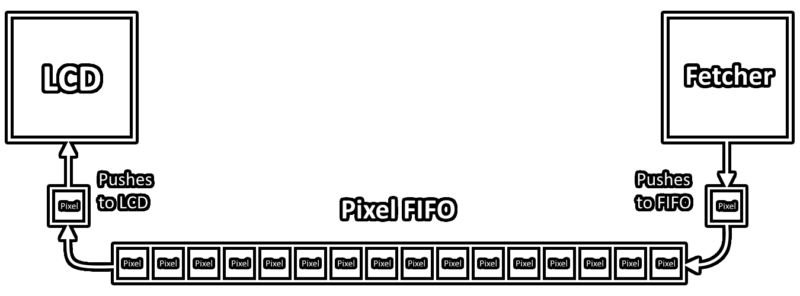
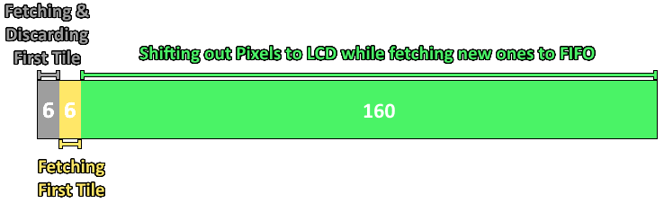

[<< Back to Main Page](../)

# The PPU

- [An Introduction](#an-introduction)
- [A Word of Warning](#a-word-of-warning)
- [The Basics](#the-basics)
  * [The Screen](#the-screen)
  * [What's Shown on Screen](#what-s-shown-on-screen)
  * [The Tech Behind It](#the-tech-behind-it)
- [PPU Modes](#ppu-modes)
  * [154 Scanlines?](#154-scanlines-)
  * [Mode 2 - OAM Search](#mode-2---oam-search)
  * [Mode 3 - Drawing](#mode-3---drawing)
  * [Mode 0 - HBlank](#mode-0---hblank)
  * [Mode 1 - VBlank](#mode-1---vblank)
- [The Pixel FIFO](#the-pixel-fifo)
  * [FIFO Operation](#fifo-operation)
    + [What's a Pixel?](#what-s-a-pixel-)
    + [Pixel Data](#pixel-data)
  * [Background Rendering](#background-rendering)
    + [Background Pixel Fetching](#background-pixel-fetching)
    + [Combining Fetching and Drawing](#combining-fetching-and-drawing)
    + [The first-tile oddity](#the-first-tile-oddity)
    + [Timing Visualization](#timing-visualization)
  * [Window Rendering](#window-rendering)
    + [Low WX Values](#low-wx-values)
    + [Changing WX Mid-Scanline](#changing-wx-mid-scanline)
    + [Timing Visualization](#timing-visualization-1)
  * [Sprite Rendering](#sprite-rendering)
    + [Sprite Pixel Fetching](#sprite-pixel-fetching)
    + [Sprites with an equal X-Position](#sprites-with-an-equal-x-position)
    + [Sprites with X < 8](#sprites-with-x---8)

## An Introduction

The PPU (which stands for Picture Processing Unit) is the part of the GameBoy that's responsible for everything you see on screen and more and possibly the second most integral part of the whole machine right after the CPU. While it is technically less complex than the CPU, it's a lot more tricky and less unambiguously documented, which is why I'm hoping to provide an easy and quick to understand summary of everything here.

## A Word of Warning

I want to be clear about one thing: This documentation is most likely not 100% fully accurate. It's a combination of information from various sources as well as experiences I've personally made while developing my emulator. If you find anything off, please do contact me personally on Discord (Optix™#1337) or create a PR.

**Also,** the current version of this documentation focuses only on DMG emulation, no CGB or SGB features are considered.

## The Basics

### The Screen

As mentioned before, one of the tasks of the PPU is to act as the interface to the video output for the whole machine. The screen is a 160x144 pixel LCD which supports up to 4 different shades of gray (which look green on the original DMG).

### What's Shown on Screen

Effectively, the GameBoy has three "layers" which it can draw on - the Background, the Window and Object Sprites, all of which will be elaborated on later on in the documentation. One thing that is true for all layers is that the images are based on 8x8 pixel tiles, which are stored in memory as 16 bytes each. How exactly the image data is stored will be explained later on as well.

### The Tech Behind It

Before we get into the technology let's define an important term first - a "scanline". A scanline is a single row of 160 pixels which are drawn to the screen, so any GameBoy-rendered image has a total of 144 scanlines.

Now that that's all cleared up, let's get to the technical part. Many emulators implement image rendering on a scanline-basis, which means that one whole scanline is drawn at once. This works perfectly fine for most games, but there are some exceptions which use special effects that can only be achieved with what's known as a "Pixel FIFO" implementation.

## PPU Modes

The PPU operates in 4 different modes, the timing of which is visualized in the image below (taken from the GameBoy Pandocs). The details of each mode will be explained shortly.

### 154 Scanlines?

According to the diagram above, during the rendering of one frame the PPU handles a total of 154 scanlines, even though the LCD display only has 144 rows. This is due to what's known as VBlank Mode, which adds 10 pseudo-scanlines to the bottom of the frame where nothing is actually rendered and the PPU is effectively paused. More information on that shortly.

### Mode 2 - OAM Search

The first mode the PPU is in when starting a scanline (that isn't VBlank) is the OAM Search mode. It takes a total of 80 T-cycles and is responsible for scanning memory for sprites that should be rendered on the scanline the PPU is currently rendering.

During OAM Search the VRAM Sprite Attribute Table is scanned, the scan for each entry taking 2 T-cycles. For every Sprite a few conditions are checked and, if all apply, the Sprite is pushed to a separate OAM Buffer (which has nothing to do with the Pixel FIFO). The conditions are as follows:

* Sprite X-Position must be greater than 0
* LY + 16 must be greater than or equal to Sprite Y-Position
* LY + 16 must be less than Sprite Y-Position + Sprite Height
* The amount of sprites already stored in OAM Buffer must be less than 10

**Note:** During Mode 2 the CPU should not be able to access the OAM part of memory ($FE00 - $FE9F). Any attempts at writing to it should be ignored and reading from it should return 0xFF.

### Mode 3 - Drawing

Mode 3 is the "main" mode of the PPU, this is where the magic happens. Its length is variable and changes depending on how many sprites are to be drawn on the scanline, whether or not the window should be drawn on the scanline and many more factors, all of which will also be explained later on.

**Note:** During this mode the CPU shouldn't be able to access either OAM ($FE00 - $FE9F) or VRAM ($8000 - $9FFF). Like in Mode 2, any attempts at writing to it should be ignored and reading from it should return 0xFF.

### Mode 0 - HBlank

This mode takes up the remainder of every scanline after drawing is done, and always lasts until the scanline the PPU is currently rendering has been worked on for 456 T-Cycles. During this mode all memory is accessible by the CPU, which is why some games use this time segment to modify data in OAM or VRAM.

### Mode 1 - VBlank

VBlank mode takes up all scanlines from 144 to 153 (zero-based) and effectively acts as a "PPU pause" the same way HBlank does. It is however considerably longer and allows for the game to make larger changes to OAM and VRAM.

## The Pixel FIFO

The Pixel FIFO, in most general terms, is a FIFO (First In First Out) Buffer which stores pixels and pushes them out onto the LCD one by one. The FIFO itself however is only the "storage" part of that system. The part that loads pixel data into the FIFO is known as the "Fetcher".

### FIFO Operation

Below is a simplified diagram of how the Pixel FIFO operates. The Fetcher gets pixel data from memory and pushes it into the FIFO, while the PPU is shifting out pixels to the LCD on the other side. This operation is repeated scanline by scanline until a full image is rendered, then it restarts. (Not right away, more details later)

#### What's a Pixel?

What's shown as a "Pixel" in the image above isn't just data that shows what color to display on screen, one pixel has to store multiple attributes:

* The Color Number (2 bits => value from 0 to 3)
* The Color Palette (Only really necessary for pixels that belong to sprites)
* Whether or not the pixel belongs to a sprite

#### Pixel Data

As mentioned before, GameBoy graphics work with 8x8 pixel tiles which are stored as 16 bytes. Each 2 bytes make up a row of 8 pixels, which is why 2 * 8 = 16 bytes make up a whole 8x8 tile.

A great explanation of how 2 bytes make up a row of 8 pixels can be found [here](https://www.huderlem.com/demos/gameboy2bpp.html). (TODO: Write own description)

### Background Rendering

The simplest utilization of the Pixel FIFO is basic background rendering. No sprites, no window, just background. Here we'll get to know the Fetcher a little more and look into how it operates in detail.

#### Background Pixel Fetching

Once the OAM Scan is done, background pixel fetching begins. And, usually, this process keeps repeating over and over until the scanline is fully rendered. Fetching 8 pixels and pushing them to Pixel FIFO takes a total of 8 T-cycles.

The fetcher internally keeps track of which tile it is fetching (I will refer to this as LX, to stay consistent with the generally agreed upon naming of the LY register). For each tile on the scanline the following operations occur:

* **Cycle 1-2:** The fetcher reads the tile number from memory.
* **Cycle 3-4:** The fetcher reads the lower 8 bits of the 8-pixel-row data.
* **Cycle 5-6:** The fetcher reads the upper 8 bits of the 8-pixel-row data.
* **Cycle 7-8:** The fetcher pushes the 8 pixels onto Pixel FIFO.

**Note:** *Technically* the fetcher attempts to push its 8 fetched pixels onto FIFO at the end of Cycle 6 already, however, as the PPU can't shift out pixels fast enough to allow for this, the fetcher only succeeds at this at the end of cycle 8.

#### Combining Fetching and Drawing

Now that we know how to fetch background pixels we can start combining them with the drawing logic.

The first 6 T-Cycles of the scanline nothing is drawn, as the Pixel FIFO is still empty and the fetcher is going through its first steps. On the 7th Cycle the fetcher pushes the first 8 pixels to the FIFO, and the first pixel is shifted out onto the LCD immediately in the same cycle after being pushed to FIFO.

On the 8th cycle the fetcher resets and another pixel is shifted out onto LCD, leaving 6 more pixels in FIFO. These are shifted out every T-cycle, while the fetcher runs through its first 6 fetching cycles. Then again, on the 12th cycle total, the fetcher pushes 8 more pixels to FIFO, one of which is again shifted to LCD in the same cycle. This cycle continues over and over until the PPU shifts out the 160th pixel.

Once it has reached the 160th pixel the PPU resets everything Pixel FIFO-related. It clears anything that's left in FIFO and fully resets the fetcher to its initial state at the beginning of the scanline in order to get it ready for the next scanline.

#### The first-tile oddity

Doing the math, the drawing mode, when only drawing background tiles, should take 166 T-cycles per scanline. However, the minimum amount of cycles needed for Mode 3 is 172. Why?

This is due to an oddity with the background fetcher. It starts operating as usual at the start of the scanline, reading the tile number, the lower and the upper 8 bits of tile data. However, it discards all data it fetched and restarts itself without pushing any data to the FIFO. This adds the 6 T-cycles to the beginning of Mode 3, adding it up to 172 cycles.

#### Timing Visualization

### Window Rendering

With background rendering working correctly, window rendering isn't much of a challenge. The window effectively acts as a "restart" of the fetcher. Before anything - bit 5 of LCDC ($FF40) must be set for anything following to take place.

When a pixel is shifted out onto LCD, and the X-Coordinate which the next pixel would be rendered at is equal to WX - 7, the "window reset" starts. The fetcher is reset entirely to its first step, anything that has already been fetched is discarded, the Pixel FIFO is cleared and internally a switch is flipped that tells the fetcher to, from now on, fetch window tiles rather than background tiles. However, as the fetcher needs to fully restart fetching, rendering is paused for a total of 6 T-cycles on every scanline when encountering a window. This extends the total time needed by Mode 3 by 6 T-cycles as well.

#### Low WX Values

If WX is between 0 and 7 the fetcher never enters "background fetching" mode and goes straight to fetching window tiles, effectively bypassing the 6-cycle delay that would occur when switching from background to window.

#### Changing WX Mid-Scanline

(**Warning:** This section may not be accurate due to a lack of unambiguous documentation)

If the value of the WX register is changed mid-scanline, the PPU will keep fetching window tiles and pushing them to the LCD. When the X-coordinate of the currently fetched pixel hits WX - 7 again, a background pixel with a color value of 0 is pushed onto the FIFO.

#### Timing Visualization

Assuming that WX = 107, the following timing would occur:

### Sprite Rendering

A general prerequisite for sprite rendering to occur is bit 1 of LCDC ($FF40) being set. If this is the case, the PPU will search through the OAM buffer which was filled during Mode 2 to check if there are any sprites at this position. (Note that the sprite's X-coordinate in memory is 8 lower than its actual position on screen, meaning an X-coordinate of 0 is off-screen and an X-coordinate of 8 renders the sprite at the leftmost side of the screen). If there are, multiple things occur:

* Shifting pixels out to LCD is paused
* Fetching background/window pixels is paused
* The sprite fetcher (separate to the background/window fetcher) is started

#### Sprite Pixel Fetching

Fetching sprite pixels works effectively the same as fetching background or window pixels. However, the pixels aren't pushed to FIFO directly. Each of the 8 sprite pixels is compared to the pixel currently in FIFO at the same index - the first sprite pixel is compared to the pixel that would be shifted to LCD next, the second to the one after that and so on.

This process is commonly referred to as "merging". A sprite pixel replaces the pixel it is being compared to if the following conditions all apply:

* The pixel in FIFO is not already a sprite pixel
* The color number of the sprite pixel is not zero
* If Sprite Attribute Bit 7 is set: The color number of the pixel in FIFO is equal to zero

If any of the above conditions isn't met the sprite pixel is discarded and the pixel in FIFO stays, otherwise the pixel in FIFO is overwritten by the sprite pixel.

After the fetching and merging process is finished, both background/window fetching and LCD shifting are resumed as normal, unless there is another sprite in the OAM buffer at the same X coordinates. Details [here.](#sprites-with-an-equal-x-position)

**Interesting sidenote:** The fact that sprite pixels which are already in FIFO cannot be overwritten explains why most documentations (including the Pandocs) explain sprite-to-sprite priority with "the sprite with lower X-coordinate has priority" - the sprite pixels are fetched earlier the lower the X-coordinate is, and as sprite pixels in FIFO cannot be overwritten, any other sprite pixels that *would* be merged are not, resulting in the first sprite taking priority.

#### Sprites with an equal X-Position

In the case of two sprites being loaded into the OAM buffer which have the same X-Position, only the first in the list is actually rendered (assuming the OAM buffer is ordered from lowest memory address to highest). *Technically* it wouldn't be necessary to restart the pixel fetcher for any sprite at the same X-Position other than the first, as all sprite pixels will be discarded in the merging process. However, all sprites at the same X-Position should still occupy the fetcher for 6 T-cycles each. **(Todo: Confirm this)**

#### Sprites with X < 8

If the X-position of the sprite is < 8, fetching first occurs as expected. However, before merging the sprite pixels with FIFO, 8 - X pixels are discarded. For example: X = 2, the fetcher fetches all 8 pixels and discards 8-2 = 6 of them, leaving 2 pixels to be merged onto FIFO.

**Note:** The fetching process for sprites with an X-Position < 8 starts immediately after the first background/window tile is pushed onto FIFO, as shifting pixels to LCD before fetching sprite data would yield incorrect results.

