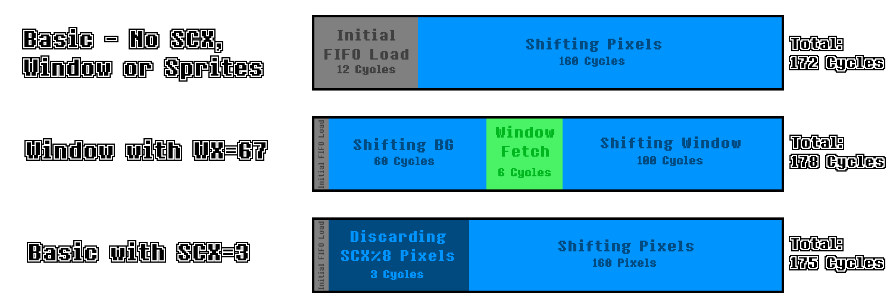

[<< Back to Last Page](../)

# The PPU

- [An Introduction](#an-introduction)
- [A Word of Warning](#a-word-of-warning)
- [The Basics](#the-basics)
  * [The Screen](#the-screen)
  * [The Concept of Tiles](#the-concept-of-tiles)
    + [Pixel Data](#pixel-data)
  * [Display Layers](#display-layers)
    + [The Background](#the-background)
    + [The Window](#the-window)
      - [The WX and WY Registers](#the-wx-and-wy-registers)
    + [Sprites](#sprites)
  * [Tile Data](#tile-data)
  * [Background Maps](#background-maps)
  * [OAM Memory](#oam-memory)
  * [The Concept of Scanlines](#the-concept-of-scanlines)
  * [The Concept of PPU Modes](#the-concept-of-ppu-modes)
    + [OAM Scan (Mode 2)](#oam-scan-mode-2)
    + [Drawing (Mode 3)](#drawing-mode-3)
    + [H-Blank (Mode 0)](#h-blank-mode-0)
    + [V-Blank (Mode 1)](#v-blank-mode-1)
    + [Timing Diagram](#timing-diagram)
- [The Pixel FIFO](#the-pixel-fifo)
  * [OAM Scanning](#oam-scanning)
  * [Background Pixel Fetching](#background-pixel-fetching)
  * [Pushing Pixels to the LCD](#pushing-pixels-to-the-lcd)
    + [SCX at a Sub-Tile-Layer](#scx-at-a-sub-tile-layer)
  * [Sprite Fetching](#sprite-fetching)
    * [Timing Oddities](#timing-oddities)
  * [Pixel Mixing](#pixel-mixing)
  * [Window Fetching](#window-fetching)
  * [Ending a Scanline](#ending-a-scanline)
- [PPU Registers](#ppu-registers)
  * [LCD Control Register (LCDC : $FF40)](#lcd-control-register--lcdc----ff40-)
  * [LCD Status Register (STAT : $FF41)](#lcd-status-register--stat----ff41-)

# An Introduction

The PPU (which stands for Picture Processing Unit) is the part of the Gameboy that’s responsible for everything you see on screen. It is the second most integral part of the whole machine right after the CPU, however, in terms of complexity it beats the CPU by far. The PPU is a lot more tricky and less unambiguously documented, which is why I’m hoping to provide an easy and quick to understand summary of everything here.

# A Word of Warning

I want to be clear about one thing: This documentation is most likely not 100% fully accurate. It’s a combination of information from various sources as well as experiences I’ve personally made while developing my emulator. If you find anything off, please do contact me personally on Discord (Optix™#1337) or create a PR.

**Also,** the current version of this documentation focuses only on DMG emulation, no CGB or SGB features are considered.

# The Basics

## The Screen

The screen of the original DMG Gameboy is a 160x144 pixel LCD which can display up to 4 different shades of gray. These appear green on the original DMG, but many emulators support custom color palettes to allow the user to manually configure which colors should be displayed.

## The Concept of Tiles

While the screen has a resolution of 160x144 pixels, pixels cannot be "written to" directly. The Gameboy can only display 8x8 pixel tiles. These are more or less "fixed 8x8 pixel textures" which can be placed on the screen in a set grid. Some exceptions apply to this, but these will be explained later on.


### Pixel Data

 Since the original DMG Gameboy only supports a palette of 4 different colors, 2 bits are needed to store color data for a single pixel. Hence, the Gameboy stores graphics data in a format commonly referred to as "2BPP", which stands for "2 bits per pixel".

In the Gameboy's 2BPP format, 2 bytes make up a row of 8 pixels. Each bit of the first byte is combined with the bit at the same position of the second byte to calculate the color number, as shown here, using `0xA5 0xC3` as example data:


In memory Tiles are stored as 16 bytes encoded with the method explained above. The first 2 bytes represent the first line of 8 pixels, the next 2 the second line, and so on.

## Display Layers

The Gameboy display effectively uses three separate layers to display graphics on - the Background, the Window and Sprites.

### The Background

The Background is a 32x32 tile grid (=256x256 pixels) in which Tiles can be placed. However, the Gameboy can only show a 20x18 tile (=160x144 pixels) section of the background at any given time. This section will be referred to as the "viewport" here. Which section is shown can be determined using the SCX and SCY registers (explained later on), which can be set by the program. The values in these registers determine how many pixels the viewport is offset from the left and the top border of the background respectively. If the viewport exceeds the border of the background it wraps back around to the left/top respectively.


### The Window

The Window is the same as the Background in that it is another 32x32 tile grid which Tiles can be placed on. However, it can be seen as a sort of "overlay" over the background, the position of which can be determined using WX and WY registers, which will also be explained later on.


#### The WX and WY Registers

The WY register is the more simple of the two. Using the memory address $FF4A, the program can set the Y-Position at which the top border of the window should be placed, 0 meaning the very top.

The WX register found at memory address $FF4B has a few oddities. In order to place the window at the far left border of the screen, the value 7 must be written to the register. Values lower than 7 cause strange edge cases to occur, which are yet to be documented here. However, for games that use WX values below 7, these can mostly be ignored.

Effectively, the horizontal position at which the window should be displayed can be calculated using `WX - 7`. A WX value of 6 for example (ignoring the aforementioned edge cases) puts the leftmost column of pixels off screen and starts rendering the window at the second column, as demonstrated here:


(**Note:** The graphic above is not to scale.)

### Sprites

Sprites are effectively just 8x8 (or, if certain options are set, 8x16) pixel tiles which are not limited by the background/window grid. Sprite data is stored in the OAM section of memory which can fit up to 40 sprites.


## Tile Data

Graphics data encoded in the 2BPP format (explained above) is stored in VRAM at addresses $8000-$97FF and is usually referred to by so-called "Tile Numbers". As each tile takes up 16 bytes of memory, a "Tile Number" is essentially just an index of a 16-byte-block within this section of VRAM. However, there are two different addressing methods the PPU uses:

The **8000 method** uses $8000 as a base pointer and adds `(TILE_NUMBER * 16)` to it, where `TILE_NUMBER` is an unsigned 8-bit integer. Thus, the Tile Number `0` would refer to address $8000, `1` would refer to $8010, `2` to $8020 and so on.

The **8800 method** uses $9000 as a base pointer and adds `(SIGNED_TILE_NUMBER * 16)` to it, where `SIGNED_TILE_NUMBER` is a signed 8-bit integer. Thus, the tile number `0` would refer to address $9000, `1` would refer to $9010, `2` to $9020 and so on. However, `0xFF` would refer to $8FF0, `0xFE` to $8FE0 and so on.

Which of these addressing methods is used depends on bit 4 of the LCDC register, which will be explained later on as well.

## Background Maps

In order to set which tiles should be displayed in the Background / Window grids, background maps are used. The VRAM sections $9800-$9BFF and $9C00-$9FFF each contain one of these background maps.

A background map consists of 32x32 bytes representing tile numbers organized row by row. This means that the first byte in a background map is the Tile Number of the Tile at the very top left. The byte after is the Tile Number of the Tile to the right of it and so on. The 33rd byte would represent the Tile Number of the leftmost tile in the second tile row.

## OAM Memory

The OAM (standing for "Object Attribute Memory") section of memory ranges from $FE00-$FE9F and contains data used to display Sprites (also known as "Objects") on screen. Each sprite takes up 4 bytes in this section of memory, allowing for a total of 40 sprites to be displayed at any given time. Each entry is structured as follows:

**Byte 0 - Y-Position:** The first byte of each entry represents the vertical position of the sprite on the screen. However, in order to allow sprites to move sprites into the frame from the top smoothly, 16 is subtracted from this value to determine the actual Y-Position. This means that a Y-Position of 16 would place the sprite at the top border of the screen.

**Byte 1 - X-Position:** The second byte represents the horizontal position of the sprite on the screen. Like with the Y-Position, moving sprites into frame smoothly is allowed by subtracting 8 from this value. This means that an X-Position of 8 would place the sprite at the left border of the screen, whereas a value of 0 would fully hide the sprite.

**Byte 2 - Tile Number:** The third byte of each OAM entry represents the Tile Number used for fetching the graphics data for the sprite. Note that sprites always use the "8000 addressing method", so this value is always interpreted as an unsigned 8-bit integer.

**Byte 3 - Sprite Flags:** The last byte of each entry contains bit-flags that can apply certain effects and options to a sprite, as seen here:

```
Bit 7    OBJ-to-BG Priority
          0 = Sprite is always rendered above background
          1 = Background colors 1-3 overlay sprite, sprite is still rendered above color 0
Bit 6    Y-Flip
          If set to 1 the sprite is flipped vertically, otherwise rendered as normal
Bit 5    X-Flip
          If set to 1 the sprite is flipped horizontally, otherwise rendered as normal
Bit 4    Palette Number
          If set to 0, the OBP0 register is used as the palette, otherwise OBP1
Bit 3-0  CGB-Only flags
```

## The Concept of Scanlines

As the PPU cannot just set all pixels on the LCD directly, the concept of scanlines is used for rendering frames. In the most simple terms, a "scanline" is simply a row of pixels on the screen. The PPU goes from left to right along the scanline and places the pixels one by one, and once it's done, it continues to the next scanline. Do note that the PPU operates on a pixel-basis, and not on a tile-basis.


The number of the scanline the PPU is currently processing is stored in the so-called LY Register, which is why the term "LY" is often used instead of "the current scanline number".

## The Concept of PPU Modes

During a scanline the PPU enters multiple different modes, each with specific functions. There are four of these modes in total:

### OAM Scan (Mode 2)

This mode is entered at the start of every scanline (except for V-Blank) before pixels are actually drawn to the screen. During this mode the PPU searches OAM memory for sprites that should be rendered on the current scanline and stores them in a buffer. This procedure takes a total amount of 80 T-Cycles, meaning that the PPU checks a new OAM entry every 2 T-Cycles.

A sprite is only added to the buffer if all of the following conditions apply:

* Sprite X-Position must be greater than 0
* LY + 16 must be greater than or equal to Sprite Y-Position
* LY + 16 must be less than Sprite Y-Position + Sprite Height (8 in Normal Mode, 16 in Tall-Sprite-Mode)
* The amount of sprites already stored in the OAM Buffer must be less than 10

### Drawing (Mode 3)

The Drawing Mode is where the PPU transfers pixels to the LCD. The duration of this mode changes depending on multiple variables, such as background scrolling, the amount of sprites on the scanline, whether or not the window should be rendered, etc. All of the specifics to these timing differences will be explained later on.

### H-Blank (Mode 0)

This mode takes up the remainder of the scanline after the Drawing Mode finishes, more or less "padding" the duration of the scanline to a total of 456 T-Cycles. The PPU effectively pauses during this mode.

### V-Blank (Mode 1)

V-Blank mode is the same as H-Blank in the way that the PPU does not draw any pixels to the LCD during its duration. However, instead of it taking place at the end of every scanline, it's a much longer period at the end of every frame.

As the Gameboy has a vertical resolution of 144 pixels, it would be expected that the amount of scanlines the PPU handles would be equal - 144 scanlines. However, this is not the case. In reality there are 154 scanlines, the 10 last of which being "pseudo-scanlines" during which no pixels are drawn as the PPU is in the V-Blank state during their duration. A V-Blank scanline takes the same amount of time as any other scanline - 456 T-Cycles.

### Timing Diagram

The following diagram (a simplified version of the original from the Gameboy Pandocs) shows a visual explanation of the timing of the individual modes explained above:


# The Pixel FIFO

The Gameboy doesn't render a whole frame or even just a whole scanline all at the same time. Instead, individual pixels are pushed to the LCD one by one. In order to accomplish this, the so-called Pixel FIFO is used. This is effectively a combination of two "shift registers" which can each hold data of up to 8 pixels. Each pixel stored in the FIFO needs to keep track of the following properties:

* **Color:** The color number (IGNORING the palette, this value is the color value from the tile data)
* **Palette:** OBP0 / OBP1 for DMG, a value between 0 and 7 on CGB
* **Sprite Priority:** Only relevant for Sprites on CGB
* **Background Priority:** Only relevant for Sprites, keeps the value of Bit 7 (OBJ-to-BG Priority) of the Attributes byte of the sprite

One of these 8-pixel Shift Registers is referred to as the "Background FIFO", as it's loaded with background/window data pixels. The other is the Sprite FIFO, which is in charge of buffering Sprite pixels. The pixels from both of these registers are merged during the process of being shifted out to the LCD, but this process will be explained in more detail later.

## OAM Scanning

At the start of each scanline, the PPU scans OAM for sprites it has to render on the current scanline. The details on this operation are described in the [OAM Scan (Mode 2)](#oam-scan-mode-2) section. The buffer in which the "to-render" sprites are stored will be referred to as the "Sprite Buffer".

## Background Pixel Fetching

The component responsible for loading the FIFO registers with data is the Pixel Fetcher. This fetcher is continuously active throughout PPU Mode 3 and keeps supplying the FIFO with new pixels to shift out. The process of fetching pixels is split up into 4 different steps, which take 2 T-Cycles each to complete:

* **1) Fetch Tile No.**:
  During the first step the fetcher fetches and stores the tile number of the tile which should be used. Which Tilemap is used depends on whether the PPU is currently rendering Background or Window pixels and on the bits 3 and 5 of the LCDC register. Additionally, the address which the tile number is read from is offset by the fetcher-internal X-Position-Counter, which is incremented each time the last step is completed. The value of `SCX / 8` is also added if the Fetcher is not fetching Window pixels. In order to make the wrap-around with SCX work, this offset is ANDed with `0x1f`. An offset of `32 * (((LY + SCY) & 0xFF) / 8)` is also added if background pixels are being fetched, otherwise, if window pixels are being fetched, this offset is determined by `32 * (WINDOW_LINE_COUNTER / 8)`. The Window Line Counter is a fetcher-internal variable which is incremented each time a scanline had any window pixels on it and reset when entering VBlank mode.

  **Note:** The sum of both the X-POS+SCX and LY+SCY offsets is ANDed with `0x3ff` in order to ensure that the address stays within the Tilemap memory regions.

* **2) Fetch Tile Data (Low):**
  Using the Tile Number from the previous step the fetcher now fetches the first byte of tile data (with an offset of `2 * ((LY + SCY) mod 8)`) and stores it. The address which the tile data is read from depends on bit 4 of the LCDC register.

  **Note:** While fetching window pixels, the offset of `2 * ((LY + SCY) mod 8)` is replaced with `2 * (WINDOW_LINE_COUNTER mod 8)`.

* **3) Fetch Tile Data (High):**
  This step is the same as the previous, however, the next byte after the previously read address (containing the second byte of Tile Data) is read and stored.

  **Note:** The first time the background fetcher completes this step on a scanline the status is fully reset and operation restarts at Step 1. Due to the 3 steps up to this point taking up 6 T-cycles in total, and the same steps repeating again taking the same amount of time, this causes a delay of 12 T-cycles before the background FIFO is first filled with pixel data.

* **4) Push to FIFO:**
  During this step the previously fetched pixel data is decoded into actual pixels (containing all the attributes mentioned previously) and loaded into the corresponding FIFO, depending on whether the Fetcher is currently fetching Background/Window or Sprite pixels.

  **Note:** While fetching background pixels, this step is only executed if the background FIFO is fully empty. If it is not, this step repeats every cycle until it succeeds. Since all steps up to this point usually only take 6 T-cycles, and the PPU takes 8 T-cycles to shift out all 8 pixels, this step usually has to restart twice before succeeding.

## Pushing Pixels to the LCD

During each cycle, after clocking the Pixel Fetchers, the PPU attempts to push a pixel to the LCD, which can only be done if there are pixels in the background FIFO. If the Sprite FIFO contains any pixels, a sprite pixel is shifted out and "merged" with the background pixel. The details of this process will be explained later. The merged pixel is then displayed at the current scanline and at the current X-position, which the PPU keeps track of, which is incremented after the pixel is shifted out. If the background FIFO is empty, nothing happens here.


### SCX at a Sub-Tile-Layer

The SCX register makes it possible to scroll the background on a per-pixel basis rather than a per-tile one. While the per-tile-part of horizontal scrolling is handled within the fetching process, the remaining scrolling is actually done at the start of a scanline while shifting pixels out of the background FIFO. `SCX mod 8` pixels are discarded at the start of each scanline rather than being pushed to the LCD, which is also the cause of PPU Mode 3 being extended by `SCX mod 8` cycles.


## Sprite Fetching

If the X-Position of any sprite in the sprite buffer is less than or equal to the current Pixel-X-Position + 8, a sprite fetch is initiated. This resets the Background Fetcher to step 1 and temporarily pauses it, the pixel shifter which pushes pixels to the LCD is also suspended. The Sprite Fetcher works very similarly to the background fetcher:

* **1) Fetch Tile No.:**
  Same as the first Background Fetcher step, however, the tile number is simply read from the Sprite Buffer rather than VRAM.

* **2) Fetch Tile Data (Low):**
  Same as the corresponding Background Fetcher step, however, Sprites always use 8000-addressing-mode, so this step is not affected by any LCDC bits.

* **3) Fetch Tile Data (High):**
  Same as the corresponding Background Fetcher step.

* **4) Push to FIFO:**
  The fetched pixel data is loaded into the FIFO on the first cycle of this step, allowing the first sprite pixel to be rendered in the same cycle. However, the check determining whether new sprite pixels should be rendered is done first, which can cause the PPU to not shift out any pixels at all between two sprite fetches, for example if both sprites have X-values below 8 or both sprites have the same X-value.

  **Note:** During this step only pixels which are actually visible on the screen are loaded into the FIFO. A sprite with an X-value of 8 would have all 8 pixels loaded, while a sprite with an X-value of 7 would only have the rightmost 7 pixels loaded. Additionally, pixels can only be loaded into FIFO slots if there is no pixel in the given slot already. For example, if the Sprite FIFO contains one sprite pixel from a previously fetched sprite, the first pixel of the currently fetched sprite is discarded and only the last 7 pixels are loaded into the FIFO, while the pixel from the first sprite is preserved.

### Timing Oddities

When a sprite fetch is initiated the Background Fetcher is reset to step 1 and paused, and it's only able to restart fetching background pixels once the sprite data has been fetched and loaded into the Sprite FIFO. This causes the PPU to behave differently depending on how many pixels are queued up in the Background FIFO before the sprite fetch is initiated.

The PPU instantly starts pushing pixels to the LCD after the sprite fetch is done, and the Background Fetcher is restarted. However, fetching 8 background pixels takes 6 T-cycles, the same amount of time it would take for 6 pixels to be shifted out. If there are less than 6 pixels remaining in the Background FIFO when the sprite fetch is done, the PPU will have to wait for the Background Fetcher to fetch new pixels and be idle while doing so. The delay applied here is equal to `6 - REMAINING_PIXEL_COUNT`, with `REMAINING_PIXEL_COUNT` being the number of pixels in the Background FIFO when the sprite fetch finishes.

The following diagram shows the timing of an example case of a sprite fetch with a sprite at X = 68 (LCD Position 60). As `60 mod 8 = 4`, the Background FIFO contains 4 pixels before the Sprite Fetch is started.


## Pixel Mixing

If, during the shifting process, both the Background and the Sprite FIFO contain at least one pixel, they are both shifted out and compared as follows:

* 1) If the color number of the Sprite Pixel is 0, the Background Pixel is pushed to the LCD.
* 2) If the BG-to-OBJ-Priority bit is 1 and the color number of the Background Pixel is anything other than 0, the Background Pixel is pushed to the LCD.
* 3) If none of the above conditions apply, the Sprite Pixel is pushed to the LCD.

## Window Fetching

After each pixel shifted out, the PPU checks if it has reached the window. It does this by checking the following conditions:

* Bit 5 of the LCDC register is set to 1
* The condition WY = LY has been true at any point in the currently rendered frame.
* The current X-position of the shifter is greater than or equal to WX - 7

If all of these above conditions apply, Window Fetching starts. The background fetcher state is fully reset to step 1, the fetcher's internal X-Position-Counter is reset to 0 and the background FIFO is cleared. The Background Fetcher continues operation as usual, however, it now takes into account the Window-related LCDC bits and disregards SCX and SCY values completely. The Details of all changes of the fetching process are explained in the Background Pixel Fetching section above.

## Ending a Scanline

As soon as the internal X-Position-Counter reaches 160 (meaning that the 160th pixel had just been pushed) the PPU enters HBlank mode and all fetcher and FIFO operations are stopped. The registers are reset in preparation for the next scanline.

## Timing Diagram

The following diagram shows the timings of a few very basic cases during PPU Mode 3. (Not to scale, of course)



# PPU Registers

## LCD Control Register (LCDC : $FF40)

The LCDC register is one of the most important control registers for the LCD. Each of the 8 bits in this register is a flag which determines which elements are displayed and more. The following is an overview over the function of each bit:

```
Bit 7  LCD Display Enable
        Setting this bit to 0 disables the PPU entirely. The screen is turned off.
Bit 6  Window Tile Map Select
        If set to 1, the Window will use the background map located at $9C00-$9FFF. Otherwise, it uses $9800-$9BFF.
Bit 5  Window Display Enable
        Setting this bit to 0 hides the window layer entirely.
Bit 4  Tile Data Select
        If set to 1, fetching Tile Data uses the 8000 method. Otherwise, the 8800 method is used.
Bit 3  BG Tile Map Select
        If set to 1, the Background will use the background map located at $9C00-$9FFF. Otherwise, it uses $9800-$9BFF.
Bit 2  Sprite Size
        If set to 1, sprites are displayed as 1x2 Tile (8x16 pixel) object. Otherwise, they're 1x1 Tile.
Bit 1  Sprite Enable
        Sprites are only drawn to screen if this bit is set to 1.
Bit 0  BG/Window Enable
        If this bit is set to 0, neither Background nor Window tiles are drawn. Sprites are unaffected.
```

### LCDC.7 - LCD Display Enable

This bit controls whether or not the PPU is active at all. The PPU only operates while this bit is set to 1. As soon as it is set to 0 the screen goes blank and the PPU stops all operation. The PPU also undergoes a "reset" which will be explained later.

### LCDC.6 - Window Tile Map Select

This bit controls which Background Map is used to determine the tile numbers of the tiles displayed in the Window layer. If it is set to 1, the background map located at $9C00-$9FFF is used, otherwise it uses the one at $9800-$9BFF.

### LCDC.5 - Window Display Enable

This bit controls whether or not the Window layer is rendered at all. If it is set to 0, everything Window-related can be ignored, as it is not rendered. Otherwise the Window renders as normal.

### LCDC.4 - Tile Data Select

This bit determines which addressing mode to use for fetching Tile Data. If it is set to 1, the 8000 method is used. Otherwise, the 8800 method is used. (These methods are explained in the [Tile Data](#tile-data) section above)

### LCDC.3 - BG Tile Map Select

This bit controls which Background Map is used to determine the tile numbers of the tiles displayed in the Background layer. If it is set to 1, the background map located at $9C00-$9FFF is used, otherwise it uses the one at $9800-$9BFF.

### LCDC.2 - Sprite Size

As mentioned in the description of sprites above, there is a certain option which can enable "Tall Sprite Mode". Setting this bit to 1 does so. In this mode, each sprite consists of two tiles on top of each other rather than one. The tile numbers for these are calculated as follows:

To calculate the tile number of the top tile, the tile number in the OAM entry is used and the least significant bit is set to 0. The tile number of the bottom tile is calculated by setting the least significant bit to 1. 

**Example:** The Sprite Size bit is set to 1, enabling 1x2 Tile sprites. The PPU handles the OAM entry of a sprite with the tile number `0x81`. In this case, it would set the least significant bit to 0 for the top tile, resulting in the tile number `0x80`. The bottom tile would have the least significant bit set to 1, resulting in the tile number `0x81`. The exact same tile numbers would also be used if the OAM entry had a tile number of `0x80`, as they only differ in the least significant bit, which is replaced by the PPU anyway.

### LCDC.1 - Sprite Enable

This bit controls whether or not sprites are rendered at all. Setting this bit to 0 hides all sprites, otherwise they are rendered as normal.

### LCDC.0 - BG/Window Enable

This bit controls whether or not Background and Window tiles are drawn. If it is set to 0, no Background or Window tiles are drawn and all pixels are drawn as white (Color 0). The only exception to this are sprites, as they are unaffected.

**Note:** This bit has different functionality on the Gameboy Color.

## LCD Status Register (STAT : $FF41)

The STAT register contains both information-bits which allow the CPU to determine the status of the PPU, as well as bits which affect the interrupt trigger behavior of the PPU. The following is an overview over the function of each bit:

```
Bit 7   Unused (Always 1)
Bit 6   LYC=LY STAT Interrupt Enable
         Setting this bit to 1 enables the "LYC=LY condition" to trigger a STAT interrupt.
Bit 5   Mode 2 STAT Interrupt Enable
         Setting this bit to 1 enables the "mode 2 condition" to trigger a STAT interrupt.
Bit 4   Mode 1 STAT Interrupt Enable
         Setting this bit to 1 enables the "mode 1 condition" to trigger a STAT interrupt.
Bit 3   Mode 0 STAT Interrupt Enable
         Setting this bit to 1 enables the "mode 0 condition" to trigger a STAT interrupt.
Bit 2   Coincidence Flag
         This bit is set by the PPU if the value of the LY register is equal to that of the LYC register.
Bit 1-0 PPU Mode
         These two bits are set by the PPU depending on which mode it is in.
          * 0 : H-Blank
          * 1 : V-Blank
          * 2 : OAM Scan
          * 3 : Drawing
```

### STAT.6 - LYC=LY STAT Interrupt Enable

This bit (similarly to bits 5 through 3) acts as a "condition enabler" for firing STAT interrupts. This specific bit allows STAT interrupts to be triggered by a comparison of the LY register (number of current scanline) with the LYC register ($FF45, explained later on). If the values are equal, a STAT interrupt is triggered.

**Note:** This interrupt is only triggered once per scanline due to STAT IRQ Blocking explained later on.

### STAT.5-3 - PPU Mode STAT Interrupt Enable

Like bit 6, the bits 5 through 3 also act as "condition enablers" for the STAT interrupt. Specifically, they allow a STAT interrupt to be triggered whenever the PPU enters a specific mode, as described in the following table:

| **Bit** | **PPU Mode**      |
| ------- | ----------------- |
| STAT.5  | Mode 2 (OAM Scan) |
| STAT.4  | Mode 1 (VBlank)   |
| STAT.3  | Mode 0 (HBlank)   |

### STAT.2 - Coincidence Flag

This bit is updated by the PPU whenever a new scanline is started or the contents of the LYC register change. If LY=LYC, the bit is set to 1, otherwise it is set to zero. It cannot be overwritten by the CPU, as it is read-only.

### STAT.1-0 - PPU Mode

The bottom two bits of the STAT register are read-only to the CPU and are updated by the PPU each time it switches between modes. (Ref. [PPU Mode Timing](#timing-diagram)) This is important for some games, as they continuously check the value of these bits rather than using interrupts do determine the mode the PPU is in.

### STAT IRQs and Blocking

STAT Interrupts are triggered conditionally, based on the state of bits 6-3 of the STAT register. If any of the selected conditions is met, bit 1 of the Interrupt Flag register (IF) is set. However, as long as at least one of the selected conditions is met, no further STAT interrupts can be fired. This is referred to as "STAT IRQ Blocking".

**Example:** The LYC register is set to the value `0x10` and the LY=LYC STAT Interrupt condition is enabled. As soon as LY=`0x10`, the STAT interrupt is fired. While the PPU is on the same scanline, the Mode 0 STAT Interrupt condition is enabled. Usually, this would cause another STAT interrupt towards the end of the scanline as soon as the PPU switches to mode 0. However, since the LY=LYC condition is still met, the interrupt is not fired, as there is no transition from "no conditions met" to "any condition met". On the next scanline the LY=LYC condition would not be met anymore, therefore the interrupt would fire there as soon as the PPU switches to mode 0.