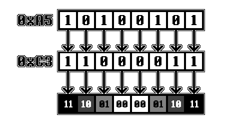

[<< Back to Main Page](../)

# The PPU

- [An Introduction](#an-introduction)
- [A Word of Warning](#a-word-of-warning)
- [The Basics](#the-basics)
  * [The Screen](#the-screen)
  * [The Concept of Tiles](#the-concept-of-tiles)
    + [Pixel Data](#pixel-data)
  * [Display Layers](#display-layers)
    + [The Background](#the-background)
    + [The Window](#the-window)
    + [Sprites](#sprites)
  * [Tile Data](#tile-data)
  * [Background Maps](#background-maps)
  * [OAM Memory](#oam-memory)

# An Introduction

The PPU (which stands for Picture Processing Unit) is the part of the Gameboy that’s responsible for everything you see on screen. It is the second most integral part of the whole machine right after the CPU, however, in terms of complexity it beats the CPU by far. The PPU is a lot more tricky and less unambiguously documented, which is why I’m hoping to provide an easy and quick to understand summary of everything here.

# A Word of Warning

I want to be clear about one thing: This documentation is most likely not 100% fully accurate. It’s a combination of information from various sources as well as experiences I’ve personally made while developing my emulator. If you find anything off, please do contact me personally on Discord (Optix™#1337) or create a PR.

**Also,** the current version of this documentation focuses only on DMG emulation, no CGB or SGB features are considered.

# The Basics

## The Screen

The screen of the original DMG Gameboy is a 160x144 pixel LCD which can display up to 4 different shades of gray. These appear green on the original DMG, but many emulators support custom color palettes to allow the user to manually configure which colors should be displayed.

## The Concept of Tiles

While the screen has a resolution of 160x144 pixels, pixels cannot be "written to" directly. The Gameboy can only display 8x8 pixel tiles. These are more or less "fixed 8x8 pixel textures" which can be placed on the screen in a set grid. Some exceptions apply to this, but these will be explained later on.


### Pixel Data

 Since the original DMG Gameboy only supports a palette of 4 different colors, 2 bits are needed to store color data for a single pixel. Hence, the Gameboy stores graphics data in a format commonly referred to as "2BPP", which stands for "2 bits per pixel".

In the Gameboy's 2BPP format, 2 bytes make up a row of 8 pixels. Each bit of the first byte is combined with the bit at the same position of the second byte to calculate the color number, as shown here, using `0xC3 0xA5` as example data:



In memory Tiles are stored as 16 bytes encoded with the method explained above. The first 2 bytes represent the first line of 8 pixels, the next 2 the second line, and so on.

## Display Layers

The Gameboy display effectively uses three separate layers to display graphics on - the Background, the Window and Sprites.

### The Background

The Background is a 32x32 tile grid (=256x256 pixels) in which Tiles can be placed. However, the Gameboy can only show a 20x18 tile (=160x144 pixels) section of the background at any given time. This section will be referred to as the "viewport" here. Which section is shown can be determined using the SCX and SCY registers (explained later on), which can be set by the program. The values in these registers determine how many pixels the viewport is offset from the left and the top border of the background respectively. If the viewport exceeds the border of the background it wraps back around to the left/top respectively.


### The Window

The Window is the same as the Background in that it is another 32x32 tile grid which Tiles can be placed on. However, it can be seen as a sort of "overlay" over the background, the position of which can be determined using WX and WY registers, which will also be explained later on.


### Sprites

Sprites are effectively just 8x8 (or, if certain options are set, 8x16) pixel tiles which are not limited by the background/window grid. Sprite data is stored in the OAM section of memory which can fit up to 40 sprites.


## Tile Data

Graphics data encoded in the 2BPP format (explained above) is stored in VRAM at addresses $8000-$97FF and is usually referred to by so-called "Tile Numbers". As each tile takes up 16 bytes of memory, a "Tile Number" is essentially just an index of a 16-byte-block within this section of VRAM. However, there are two different addressing methods the PPU uses:

The **8000 method** uses $8000 as a base pointer and adds `(TILE_NUMBER * 16)` to it, whereas `TILE_NUMBER` is an unsigned 8-bit integer. Thus, the Tile Number `0` would refer to address $8000, `1` would refer to $8010, `2` to $8020 and so on.

The **8800 method** uses $9000 as a base pointer and adds `(SIGNED_TILE_NUMBER * 16)` to it, whereas `SIGNED_TILE_NUMBER` is a signed 8-bit integer. Thus, the tile number `0` would refer to address $9000, `1` would refer to $9010, `2` to $9020 and so on. However, `0xFF` would refer to $8FF0, `0xFE` to $8FE0 and so on.

Which of these addressing methods is used depends on bit 4 of the LCDC register, which will be explained later on as well.

## Background Maps

In order to set which tiles should be displayed in the Background / Window grids, background maps are used. The VRAM sections $9800-$9BFF and $9C00-$9FFF each contain one of these background maps.

A background map consists of 32x32 bytes representing tile numbers organized row by row. This means that the first byte in a background map is the Tile Number of the Tile at the very top left. The byte after is the Tile Number of the Tile to the right of it and so on. The 33rd byte would represent the Tile Number of the leftmost tile in the second tile row.

## OAM Memory

The OAM (standing for "Object Attribute Memory") section of memory ranges from $FE00-$FE9F and contains data used to display Sprites (also known as "Objects") on screen. Each sprite takes up 4 bytes in this section of memory, allowing for a total of 40 sprites to be displayed at any given time. Each entry is structured as follows:

**Byte 0 - Y-Position:** The first byte of each entry represents the vertical position of the sprite on the screen. However, in order to allow sprites to move sprites into the frame from the top smoothly, 16 is subtracted from this value to determine the actual Y-Position. This means that a Y-Position of 16 would place the sprite at the top border of the screen.

**Byte 1 - X-Position:** The second byte represents the horizontal position of the sprite on the screen. Like with the Y-Position, moving sprites into frame smoothly is allowed by subtracting 8 from this value. This means that an X-Position of 8 would place the sprite at the left border of the screen, whereas a value of 0 would fully hide the sprite.

**Byte 2 - Tile Number:** The third byte of each OAM entry represents the Tile Number used for fetching the graphics data for the sprite. Note that sprites always use the "8000 addressing method", so this value is always interpreted as an unsigned 8-bit integer.

**Byte 3 - Sprite Flags:** The last byte of each entry contains bit-flags that can apply certain effects and options to a sprite, as seen here:

```
Bit 7    OBJ-to-BG Priority
          0 = Sprite is always rendered above background
          1 = Background colors 1-3 overlay sprite, sprite is still rendered above color 0
Bit 6    Y-Flip
          If set to 1 the sprite is flipped vertically, otherwise rendered as normal
Bit 5    X-Flip
          If set to 1 the sprite is flipped horizontally, otherwise rendered as normal
Bit 4    Palette Number
          If set to 0, the OBP0 register is used as the palette, otherwise OBP1
Bit 3-0  CGB-Only flags
```

